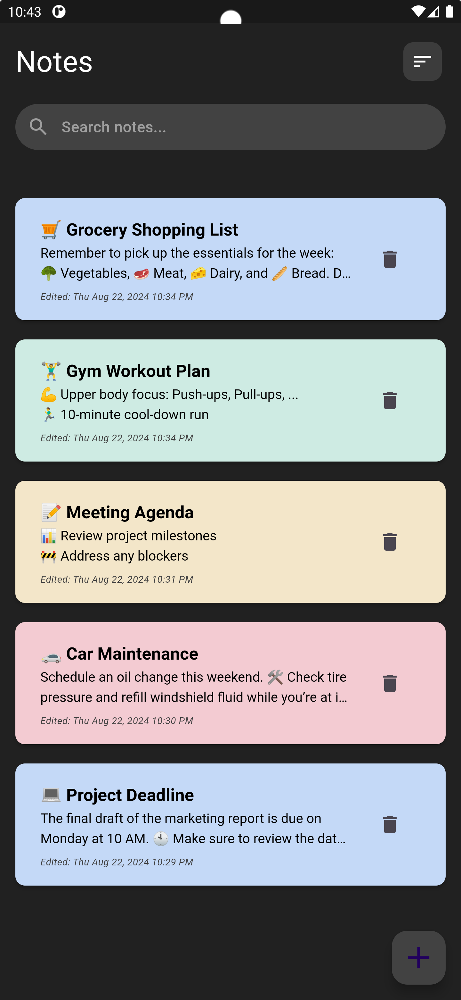
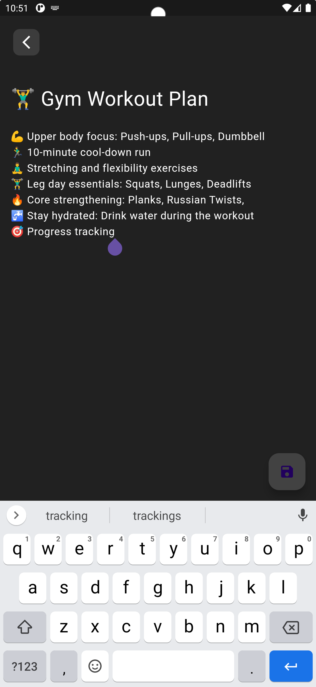
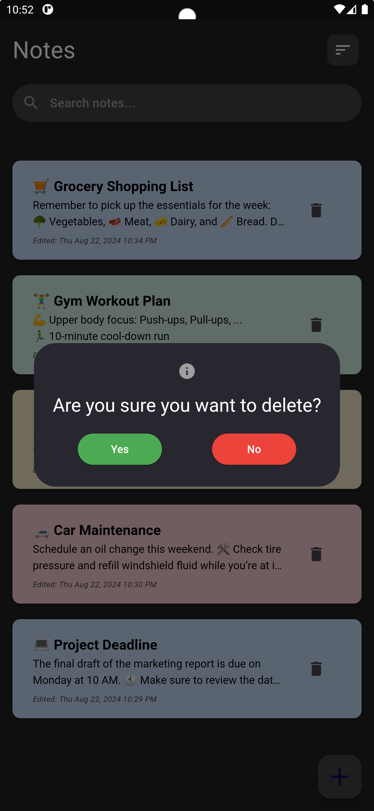

# Note App

## Project overview
The **Note App** is a simple yet powerful tool for managing your daily notes. Whether you're jotting down ideas, planning your day, or keeping track of important tasks, this app provides an easy-to-use interface to organize your notes efficiently.

## Features
- **Organized Notes**: Easily create, edit, and delete notes.
- **Search Functionality**: Quickly find notes by title or content.
- **Timestamped Edits**: Each note displays the last modified time.
- **Delete Confirmation**: Confirm before deleting a note to prevent accidental loss.

## Usage
- **Add a Note**: Click the "+" button to create a new note. Enter the title and content, then save it.
- **Edit a Note**: Tap on an existing note to modify its content or title.
- **Delete a Note**: Click the trash button on a note to delete it. A confirmation dialog will appear before the note is deleted.
- **Search Notes**: Use the search bar at the top to filter notes by their title or content.

## Screenshots
### Home Screen - List of Notes

### Adding a New Note

### Editing an Existing Note

### Deleting a Note

